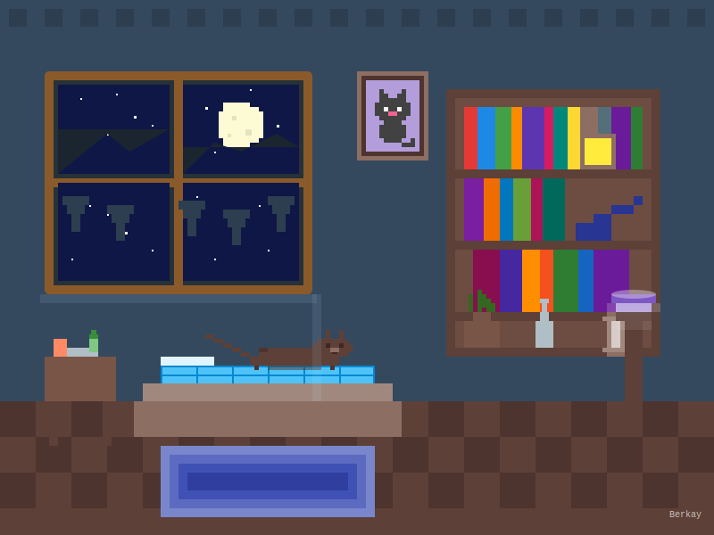

<h1 align="center">👋 Merhaba, Ben Berkay!</h1>

  
📍 <b>Tokat</b> merkezde yaşıyorum

  
👨‍💻 18 yaşındayım

  
💻 GitHub: <a href="https://github.com/scutieeop">@scutieeop</a>

  <h2>✨ Gece Odam ve Uyuyan Kedim ✨</h2>

<!-- GitHub'da düzgün görüntülenecek şekilde SVG referansı -->

  

<!-- Eğer SVG görüntülenmezse alternatif görsel olarak GIF eklenebilir -->

  
<i>Beni GitHub'da takip etmeyi unutma!</i>

---

  <h3>🚀 Yeteneklerim</h3>
  

    
    
    
  

  <h3>📊 GitHub İstatistiklerim</h3>
  

  <h3>🔥 En Çok Kullandığım Diller</h3>
  

  <h3>🌐 Sosyal Medya</h3>
  
  
  

