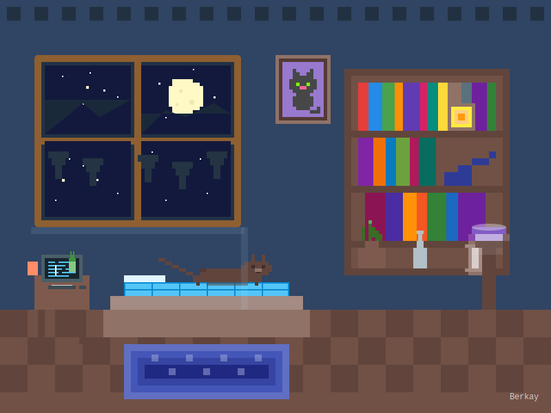

# <div align="center">👋 Merhaba, Ben Berkay!</div>

<div align="center">
  
</div>

<div align="center">
  
  
  
  
</div>

<table align="center" border="0">
  <tr>
    <td align="center">
      <a href="mailto:ofof2467yo@gmail.com">
        
        <br />
        E-mail
      </a>
    </td>
    <td align="center">
      <a href="https://www.instagram.com/s0_be4kay/">
        
        <br />
        Instagram
      </a>
    </td>
    <td align="center">
      <a href="https://discord.com/users/1246506868977696811">
        
        <br />
        Discord
      </a>
    </td>
  </tr>
</table>

---

## <div align="center">💫 Hakkımda</div>

<table border="0">
  <tr>
    <td width="70%">
      <p>Merhaba! Ben Berkay, 18 yaşında genç bir yazılım geliştiriciyim. Tokat'ta yaşıyorum ve bilgisayar teknolojilerine olan tutkumla yazılım dünyasında kendimi geliştiriyorum.</p>
      
      <p>Her gün yeni bir şeyler öğrenmeye ve projelerimle insanlara değer katmaya çalışıyorum. Web geliştirme, mobil uygulama tasarımı ve pixel art ile ilgileniyorum. Boş zamanlarımda pixel art çiziyor, video oyunları oynuyor ve yeni teknolojileri keşfediyorum.</p>
      
      <p>Teknoloji dünyasında sürekli gelişim göstererek, kullanıcı dostu ve görsel açıdan etkileyici uygulamalar geliştirmeyi amaçlıyorum. Şu anda React ve Node.js ekosisteminde kendimi geliştirerek full stack developer olmak için çalışıyorum.</p>
      
      <h3>🚀 Hedeflerim:</h3>
      <ul>
        <li>Full Stack web projeleri geliştirmek</li>
        <li>Open source projelere katkıda bulunmak</li>
        <li>Yazılım alanında mentorluk yapmak</li>
        <li>Teknoloji topluluklarında aktif olmak</li>
      </ul>
    </td>
    <td width="30%" align="right">
      
      <div align="center">
        <i>🌃 Gece Çalışma Odam</i>
      </div>
    </td>
  </tr>
</table>

```javascript
const berkay = {
  code: ['JavaScript', 'HTML', 'CSS'],
  tools: ['React', 'Node.js', 'VSCode', 'Git'],
  learning: ['MongoDB', 'Express', 'TypeScript'],
  interests: ['Web Development', 'Pixel Art', 'Game Dev', 'Cats 🐱'],
  currentFocus: 'Full Stack Developer olmak için her gün bir şeyler öğreniyorum!'
};
```

---

## <div align="center">⚙️ Yazılım Yolculuğum</div>

<div align="center">
  <table>
    <tr>
      <td align="center">
        <br />
        <b>HTML & CSS</b><br />
        İlk web sayfamı oluşturdum
      </td>
      <td align="center">
        <br />
        <b>JavaScript</b><br />
        İnteraktif web uygulamaları
      </td>
      <td align="center">
        <br />
        <b>React & Node.js</b><br />
        Modern web framework'leri
      </td>
      <td align="center">
        <br />
        <b>MERN Stack</b><br />
        Full stack projeler
      </td>
    </tr>
  </table>
</div>

---

## <div align="center">⚡ Yeteneklerim</div>

<table align="center" border="0">
  <tr>
    <td>
      <h3>💻 Frontend</h3>
      
      
      
      
      
    </td>
    <td>
      <h3>🔙 Backend</h3>
      
      
      
    </td>
  </tr>
  <tr>
    <td>
      <h3>🛠️ Araçlar</h3>
      
      
      
    </td>
    <td>
      <h3>📚 Öğrenme Sürecindeyim</h3>
      
      
      
    </td>
  </tr>
</table>

---

## <div align="center">🌙 Pixel Art Dünyam</div>

<table align="center">
  <tr>
    <td align="center" width="50%">
      
      <p><i>Kendi tasarladığım gece odam 🌃</i></p>
    </td>
    <td align="center" width="50%">
      
      <p><i>İlham kaynağım: Pixel Art animasyonları ✨</i></p>
    </td>
  </tr>
</table>

### <div align="center">🎨 Odamdaki Detaylar</div>

<div align="center">
<table>
  <tr>
    <td align="center">📚</td>
    <td><b>Kitaplık:</b> Yazılım, tasarım ve fantastik edebiyat kitaplarımın olduğu kitaplık</td>
  </tr>
  <tr>
    <td align="center">🪟</td>
    <td><b>Pencere:</b> Gece gökyüzüne, aya ve uzaktaki manzaraya açılan pencerem</td>
  </tr>
  <tr>
    <td align="center">🖼️</td>
    <td><b>Kedi Tablosu:</b> Sevdiğim kedi temalı pixel art çalışması</td>
  </tr>
  <tr>
    <td align="center">🐱</td>
    <td><b>Kedim:</b> Yatağımın üzerinde huzurla uyuyan minik dostum</td>
  </tr>
  <tr>
    <td align="center">💻</td>
    <td><b>Bilgisayar:</b> Gece geç saatlere kadar kod yazdığım çalışma istasyonum</td>
  </tr>
  <tr>
    <td align="center">💡</td>
    <td><b>Lamba:</b> Odama huzurlu bir atmosfer katan gece lambam</td>
  </tr>
</table>
</div>

---

## <div align="center">🛠️ Projelerim</div>

<div align="center">
  <p>GitHub projelerime göz atın 👇 Detaylar için projelere tıklayabilirsiniz.</p>
</div>

<div align="center">
  <details>
    <summary><strong>🌐 Kişisel Web Sitem</strong></summary>
    <div align="center">
      <h3>Kişisel Web Sitem</h3>
      
      <p>HTML, CSS ve JavaScript ile geliştirdiğim kişisel portfolyo websitem. Minimalist tasarım ve kullanıcı dostu arayüz prensiplerini uyguladım.</p>
      <h4>Özellikler:</h4>
      <ul align="left">
        <li>Responsive tasarım - tüm cihazlarda sorunsuz görüntüleme</li>
        <li>Koyu/açık tema seçeneği</li>
        <li>Animasyonlu geçişler ve scroll efektleri</li>
        <li>İletişim formu ve sosyal medya entegrasyonu</li>
        <li>Proje galerisi ve filtreleme özellikleri</li>
      </ul>
      <div>
        
        
        
      </div>
      <div align="center">
        <a href="https://github.com/scutieeop/proje1" target="_blank">
          
        </a>
        <a href="https://scutieeop.github.io/proje1" target="_blank">
          
        </a>
      </div>
    </div>
  </details>

  <details>
    <summary><strong>✅ Todo Uygulaması</strong></summary>
    <div align="center">
      <h3>Modern Todo Uygulaması</h3>
      
      <p>React ve Firebase kullanarak geliştirdiğim kapsamlı görev yönetim uygulaması. Kullanıcılar görevlerini kategorilere ayırabilir, önceliklendirebilir ve ilerlemelerini takip edebilirler.</p>
      <h4>Özellikler:</h4>
      <ul align="left">
        <li>Kullanıcı hesapları ve kimlik doğrulama sistemi</li>
        <li>Kategori ve etiket bazlı görev organizasyonu</li>
        <li>Öncelik düzeyleri ve son tarih bildirimleri</li>
        <li>Sürükle-bırak arayüzü</li>
        <li>İlerleme istatistikleri ve grafikler</li>
        <li>Offline kullanım ve senkronizasyon desteği</li>
      </ul>
      <div>
        
        
        
      </div>
      <div align="center">
        <a href="https://github.com/scutieeop/proje2" target="_blank">
          
        </a>
        <a href="https://scutieeop.github.io/proje2" target="_blank">
          
        </a>
      </div>
    </div>
  </details>

  <details>
    <summary><strong>☁️ Hava Durumu Uygulaması</strong></summary>
    <div align="center">
      <h3>Hava Durumu Uygulaması</h3>
      
      <p>Açık hava durumu API'lerini kullanarak geliştirdiğim interaktif hava durumu uygulaması. Kullanıcılar şehir arayabilir ve anlık, günlük ve haftalık hava durumu tahminlerini görüntüleyebilirler.</p>
      <h4>Özellikler:</h4>
      <ul align="left">
        <li>Konum bazlı otomatik hava durumu gösterimi</li>
        <li>5 günlük detaylı tahmin</li>
        <li>Sıcaklık, nem, rüzgar hızı ve yağış olasılığı verileri</li>
        <li>Animasyonlu hava durumu ikonları</li>
        <li>Favori konumları kaydetme</li>
        <li>Hava kalitesi indeksi entegrasyonu</li>
      </ul>
      <div>
        
        
        
      </div>
      <div align="center">
        <a href="https://github.com/scutieeop/proje3" target="_blank">
          
        </a>
        <a href="https://scutieeop.github.io/proje3" target="_blank">
          
        </a>
      </div>
    </div>
  </details>

  <details>
    <summary><strong>🎮 Pixel Art Oyunum</strong></summary>
    <div align="center">
      <h3>Retro Pixel Art Macera Oyunu</h3>
      
      <p>JavaScript ve HTML5 Canvas kullanarak geliştirdiğim retro tarzda 2D pixel art platform oyunu. Klasik oyunlardan ilham alarak modern tarayıcı teknolojileriyle oluşturuldu.</p>
      <h4>Özellikler:</h4>
      <ul align="left">
        <li>El çizimi pixel art grafikler</li>
        <li>Fizik ve çarpışma sistemleri</li>
        <li>Düşmanlar ve temel yapay zeka</li>
        <li>Bölüm tasarımı ve zorluk seviyeleri</li>
        <li>Özelleştirilebilir karakter</li>
        <li>Yerel skorboard ve kaydetme sistemi</li>
      </ul>
      <div>
        
        
        
      </div>
      <div align="center">
        <a href="https://github.com/scutieeop/pixel-game" target="_blank">
          
        </a>
        <a href="https://scutieeop.github.io/pixel-game" target="_blank">
          
        </a>
      </div>
    </div>
  </details>

  <details>
    <summary><strong>📱 Tüm Projelerim</strong></summary>
    <div align="center">
      <h3>Diğer Projelerim</h3>
      <p>GitHub profilimde daha fazla proje bulabilirsiniz. Yeni projeler sürekli eklenmektedir.</p>
      <div align="center">
        <a href="https://github.com/scutieeop?tab=repositories" target="_blank">
          
        </a>
      </div>
    </div>
  </details>
</div>

## <div align="center">🎮 Serbest Zaman Aktivitelerim</div>

<table align="center" border="0">
  <tr>
    <td align="center" width="25%">
      
      <p>Retro tarzda pixel art çizimler yapıyorum</p>
    </td>
    <td align="center" width="25%">
      
      <p>RPG ve strateji oyunları oynuyorum</p>
    </td>
    <td align="center" width="25%">
      
      <p>Bilim kurgu ve fantastik edebiyat</p>
    </td>
    <td align="center" width="25%">
      
      <p>Kod yazarken lofi ve synthwave</p>
    </td>
  </tr>
</table>

---

## <div align="center">📊 GitHub İstatistiklerim</div>

<div align="center">
  
</div>

<div align="center">
  
</div>

<div align="center">
  
</div>

<div align="center">
  
</div>

---

<div align="center">
  
</div>

<div align="center">
  <a href="https://github.com/scutieeop">
    
  </a>
</div>

<div align="center">
  
</div>

<div align="center">
  <p>✨ <b>Berkay</b> tarafından ❤️ ile yapıldı ✨</p>
</div>
